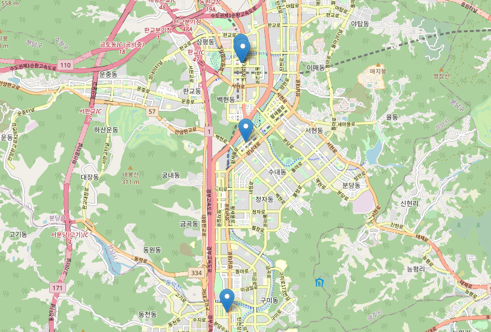

recommendProperty_op
====================
라이프스타일에 맞는 주거시설 추천 서비스 구현하는 프로젝트입니다. 이 서비스는 라이프스타일을 중요하게 여기는 2030세대를 겨냥했습니다.  
프로젝트의 문제와 해결책은 다음과 같습니다.  

* 문제 정의: 기존 부동산 서비스는 투자 목적 시세나 전월세 매물 확인용이 주요함.  
=> 라이프스타일을 중요시 여기는 2030세대에게 맞는 부동산 서비스 필요 인식.
* 해결책: 고객의 라이프스타일을 분석 후 이에 맞는 주거시설 추천하는 서비스 구현.

 

서비스의 프로세스는 다음과 같습니다.  

1. 고객이 희망하는 거주지역과 거주시설을 설정합니다.  
2. 설문조사를 통해 자주 사용하는 편의시설과 그 시설의 선호도를 입력합니다.  
3. 희망 거주시설과 자주 사용하는 편의시설 간의 최소거리 값을 측정하고, 측정값을 비율에 따라 점수화 합니다.  
4. 고객이 선호하는 시설에 차별성을 부여하고자 선호도에 따라 점수에 가중치를 부여합니다.  
5. 최종적인 결과값에서 상위 5개의 거주시설을 고객에게 추천합니다.

 

고객이 본인의 라이프스타일에 최적화된 거주시설을 선택하여 삶의 질을 향상할 수 있다고 기대합니다.

## 파일 설명
* Docs : 프로젝트 관련 모든 데이터
  * datasets: 1차 전처리 된 데이터
  * raw_data: 원본 데이터
  * table: 부록 코드 실행 결과값(오피스텔 기준 거리마다 편의시설 개수표)
* **final_result.py: 최종 코드**
* map.html: final_result: 실행 결과값 지도 시각화
* semi_result.py: 이전 코드(colab에서 실행했던 구조)

## final_result.py
### 가정
* 희망 거주지역: 경기도 성남시 분당구
* 희망 거주형태: 오피스텔
* 라이프스타일 요소: 세탁소, 헬스장, 맥도날드, 편의점, 전기차 충전소, 정형외과

### 변수 설명
* opt: 분당구에 위치한 오피스텔
* laundry: 분당구에 위치한 세탁소
* fitness: 분당구에 위치한 헬스장
* macdonalds: 분당구에 위치한 맥도날드
* convenience: 분당구에 위치한 편의점
* elec_charge: 분당구에 위치한 전기차 충전소
* clinic_os: 분당구에 위치한 정형외과

### 프로세스 설명
#### 1. Preprocessing Data (데이터 전처리)
  * 1차 전처리한 데이터 불러오기
  * 데이터의 컬럼명 변환 (한국어 -> 영어)
  
#### 2. Measuring Distance (거리값 측정)
  * 오피스텔과 최소 거리에 있는 편의시설 간 거리측정 함수 정의
    * 거리측정 방식은 [Haversine](https://pypi.org/project/haversine/) 라이브러리를 활용했습니다.
    * Haversine Formula는 위도와 경도를 이용하여 두 지점의 거리를 계산한 공식입니다.  
      평면에서 거리를 측정한 것이 아닌 지구의 구의 성질을 고려한 식입니다.
  * 각 편의시설마다 함수 대입 
  
#### 3. Scoring & Adding Weight (점수화 및 가중치 부여)
  * 거리값 측정 결과값에 등급을 나누어 차등적으로 점수 부여
  * 고객의 설문조자에서 편의시설의 선호도에 따른 차등적으로 가중치를 점수에 반영
  * 평균에 따른 상위 5개의 거주시설 결과값 도출
  
#### 4. Visualizing (시각화)
* 상위 5개의 오피스텔을 마커표시하여 시각화  

</img>

#### 5. Appendix (부록)
* 오피스텔 기준 거리 간격 마다 존재하는 편의시설 개수표 생성  
**=> 고객에게 부가적인 정보 제공**  

 

[거리에 따른 오피스텔 편의시설 개수표 보기](https://github.com/mandel-17/recommendProperty_op/blob/71604bcf0913cb0665f9f1a53a4947f5fef24666/docs/table/LG%EB%B6%84%EB%8B%B9%EC%97%90%ED%81%B4%EB%9D%BC%ED%8A%B8.csv)
